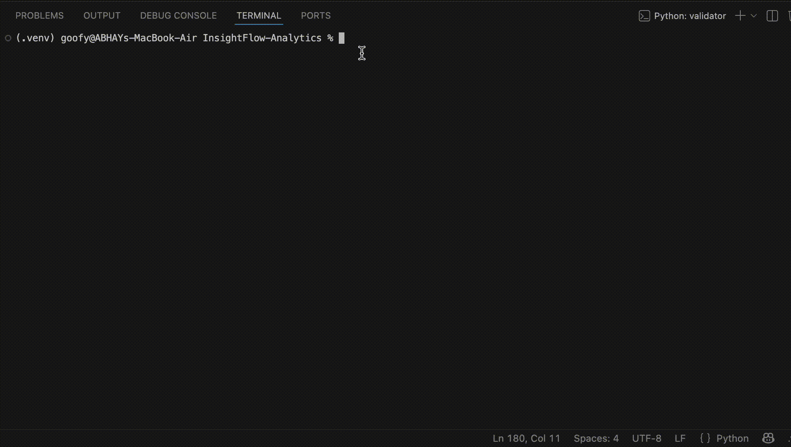
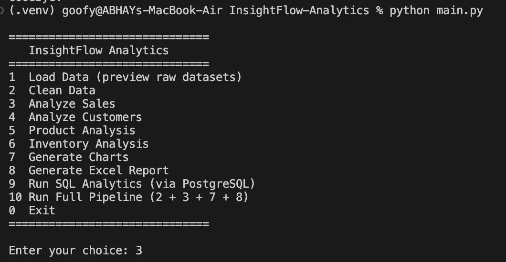
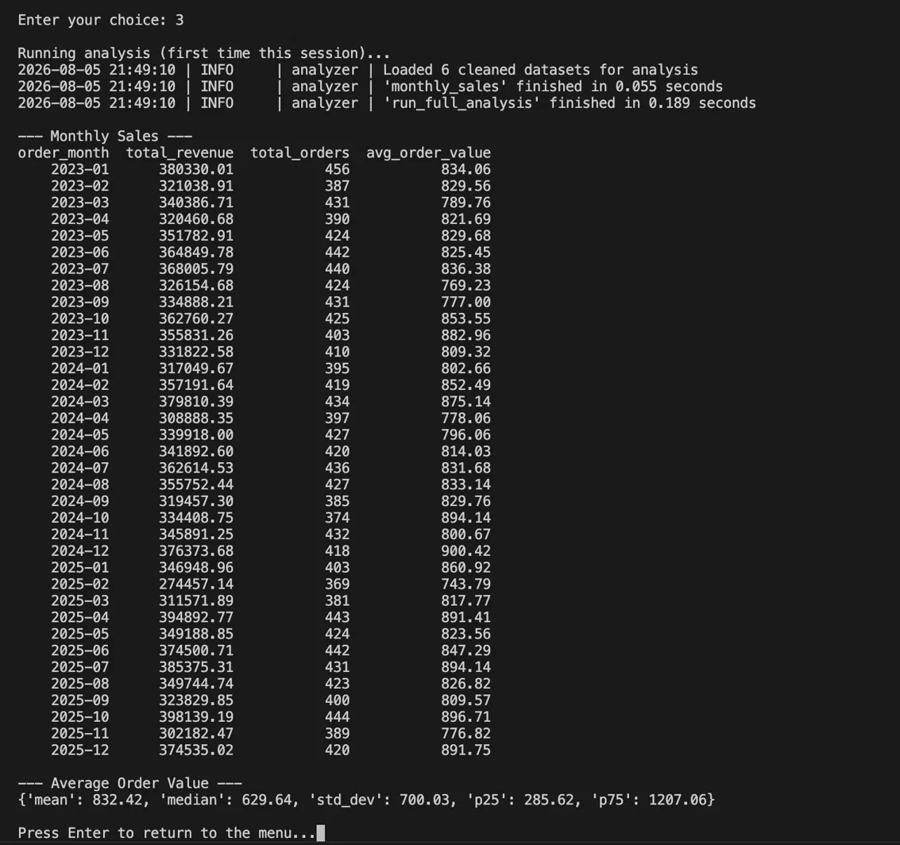
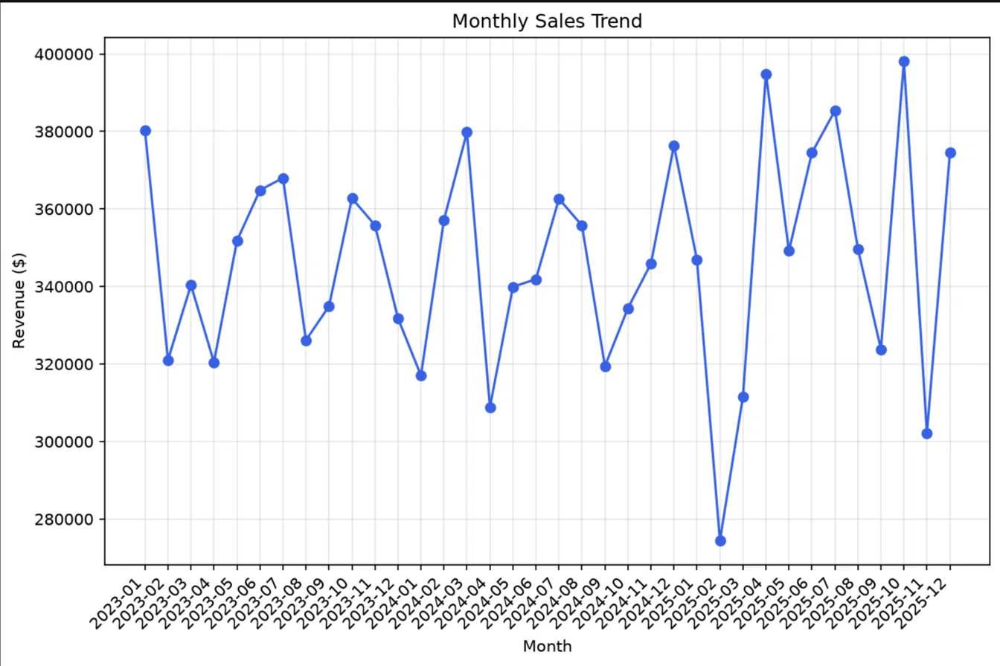
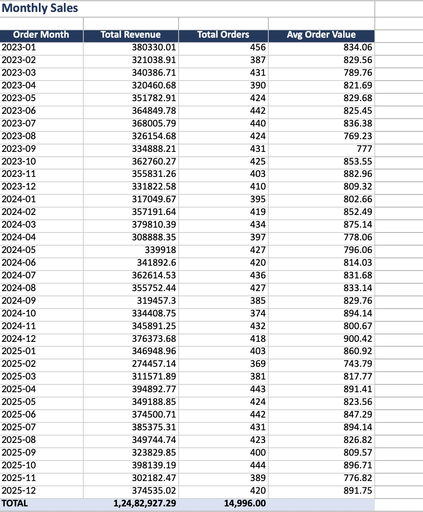

# InsightFlow Analytics

A retail analytics platform I built to practice (and prove) end-to-end data work — Python, SQL, and everything in between. It takes messy, realistic retail data and turns it into an actual PostgreSQL database, business insights, charts, and a polished Excel report, all wired together behind a simple command-line menu.

---

## Why I built this

Most beginner data projects use a dataset that's already clean — you load it, make a chart, done. That's not how it works in a real job. Real data has duplicates, missing values, typos, broken dates, and negative numbers that shouldn't exist. So instead of downloading a tidy Kaggle CSV, I generated my own retail dataset (stores, employees, products, customers, inventory, orders) and deliberately made it messy — then built the tools to actually deal with that mess, the way a data analyst would.

The pipeline looks like this:

```
Raw CSVs → Validation → Cleaning → PostgreSQL → Analysis → Charts + Excel Report
```

Everything runs through one interactive menu (`main.py`), so you don't need to remember which script does what.

---

## What it does

- **Realistic, relational data** — 15 stores, 50 employees, 300 products, 2,000 customers, ~2,600 inventory records, and 15,000 orders, all properly linked by foreign keys
- **Validation before cleaning** — a separate module just *reports* data problems (duplicates, nulls, negative values, bad dates, outliers) before anything gets touched, so the cleaning step is auditable
- **Actual cleaning logic** — deduplication, missing-value handling, type fixes, outlier handling — done in Pandas/NumPy, not just `dropna()` and hoping for the best
- **A real PostgreSQL database** — normalized schema, primary/foreign keys, indexes, and a Python connection layer built with context managers so connections always close properly
- **Business analytics that mean something** — monthly/daily sales, average order value, top customers, best & worst products, category and regional performance, low-stock alerts
- **Charts, generated automatically** — line, bar, pie, histogram, scatter, box plot, and a correlation heatmap, saved straight to `reports/charts/`
- **A proper Excel report** — multi-sheet workbook with formatted headers, filters, and totals, built with OpenPyXL (not just `df.to_excel()`)
- **Tests** — 19 pytest tests covering the cleaning logic, validation checks, and model calculations, so I'm not just trusting that the code "looks right"
- **Logging everywhere** — every module logs to both the console and a log file, which made debugging this project about 10x less painful

---

## Tech Stack

| Category | Tools |
|---|---|
| Language | Python 3.12 |
| Database | PostgreSQL |
| Data Processing | Pandas, NumPy |
| Visualization | Matplotlib |
| Reporting | OpenPyXL |
| Database Driver | psycopg2 |
| Testing | pytest |
| Environment | python-dotenv, venv |

---

## Project Structure

```
InsightFlow-Analytics/
├── main.py                    # Interactive CLI — start here
├── config.py                  # Central config (paths, DB settings)
├── requirements.txt
├── .env.example
├── .gitignore
├── datasets/
│   ├── raw/                   # Original, messy CSV data
│   └── processed/             # Cleaned, analysis-ready CSV data
├── database/
│   ├── create_tables.sql      # Production schema (PK/FK/indexes)
│   └── create_staging_tables.sql
├── reports/
│   ├── charts/                # Auto-generated PNG charts
│   └── InsightFlow_Business_Report.xlsx
├── logs/
│   └── insightflow.log
├── src/
│   ├── utils.py                # Logging + decorators
│   ├── database.py             # PostgreSQL connection layer
│   ├── models.py                # Dataclasses (Order, Customer, Product...)
│   ├── loader.py                # DB rows → model objects
│   ├── validator.py             # Data quality checks
│   ├── cleaner.py               # Data cleaning pipeline
│   ├── analyzer.py              # Business analytics
│   ├── visualizer.py            # Chart generation
│   ├── report_generator.py      # Excel report generation
│   └── dashboard.py             # Orchestrates the full pipeline
└── tests/
    ├── test_models.py
    ├── test_cleaner.py
    └── test_validator.py
```

---

## Getting it running

**1. Clone it**
```bash
git clone https://github.com/<your-username>/InsightFlow-Analytics.git
cd InsightFlow-Analytics
```

**2. Set up a virtual environment**
```bash
python3 -m venv .venv
source .venv/bin/activate        # Windows: .venv\Scripts\activate
```

**3. Install dependencies**
```bash
pip install -r requirements.txt
```

**4. Set up PostgreSQL**
```bash
psql -U postgres -c "CREATE DATABASE insightflow_db;"
psql -U postgres -d insightflow_db -f database/create_tables.sql
```

**5. Set your environment variables**
```bash
cp .env.example .env
# then open .env and fill in your real PostgreSQL credentials
```

**6. Load the data in**
Import the CSVs from `datasets/raw/` into their matching tables — either through pgAdmin's Import/Export tool, or `\copy` in `psql`.

---

## Running it

The main way to use this is the interactive menu:
```bash
python main.py
```

```
==============================
   InsightFlow Analytics
==============================
1  Load Data (preview raw datasets)
2  Clean Data
3  Analyze Sales
4  Analyze Customers
5  Product Analysis
6  Inventory Analysis
7  Generate Charts
8  Generate Excel Report
9  Run SQL Analytics (via PostgreSQL)
10 Run Full Pipeline (2 + 3 + 7 + 8)
0  Exit
==============================
```

Or skip the menu and run the whole pipeline in one shot:
```bash
python src/dashboard.py
```

Run the tests:
```bash
python -m pytest tests/ -v
```

---

## Demo



**The CLI menu**


**Sales analysis output**


**Monthly sales trend chart**


**The generated Excel report**


---

## What I'd add next

- A customer lifetime value model (right now it's just historical total spend, not predictive)
- A web version using Streamlit, so it doesn't need a terminal to explore
- GitHub Actions to run the test suite automatically on every push
- More test coverage — right now it's cleaning/validation/models, but `analyzer.py` and `report_generator.py` don't have tests yet
- Docker, so the whole setup isn't "install Postgres, hope for the best"
- Loading data incrementally instead of re-importing full CSVs every time

---

## About

Built by **Abhay Pareek** as a portfolio project to practice real-world Python, SQL, and data analytics — the messy, unglamorous parts included.

Feel free to reach out if you have questions about how any part of this works.git --version
